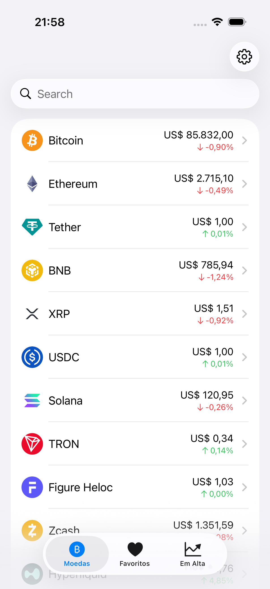
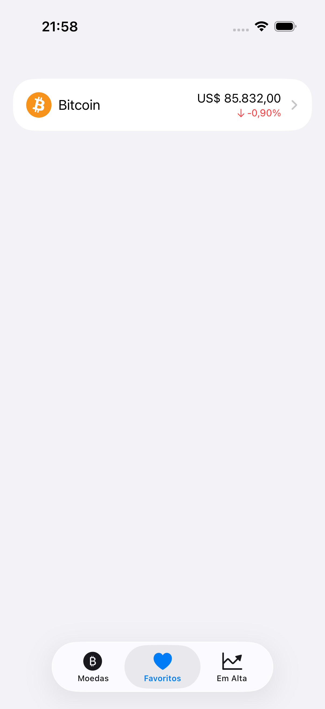
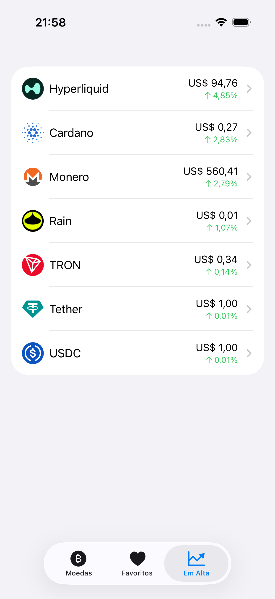
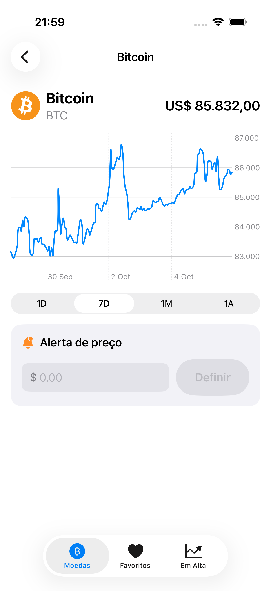
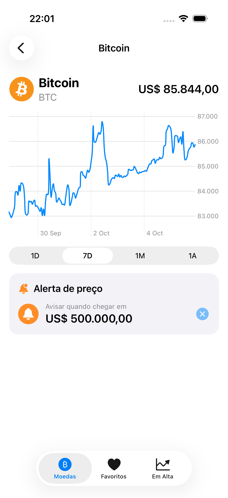
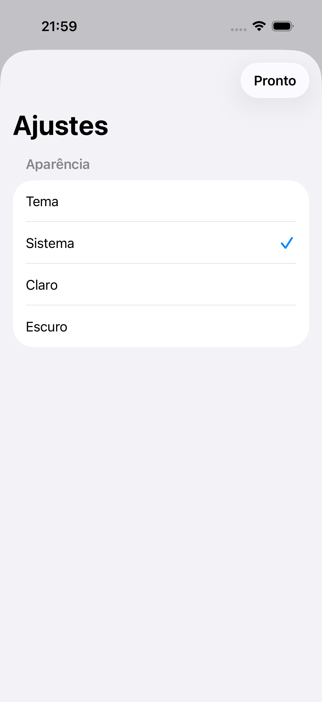

# CryptoWatch

App iOS de acompanhamento de criptomoedas, construído em SwiftUI com dados em tempo real da [CoinGecko API](https://www.coingecko.com/en/api). Projeto de portfólio, feito para estudar arquitetura MVVM, SwiftData, Swift Charts e notificações locais.

## Telas

| Lista de moedas | Favoritos | Em alta |
|---|---|---|
|  |  |  |

| Gráfico de preço | Alerta de preço | Tema |
|---|---|---|
|  |  |  |

## Funcionalidades

- **Listagem em tempo real** das principais criptomoedas (preço, variação em 24h, ícone), com busca e pull-to-refresh.
- **Favoritos** — adiciona/remove deslizando o item na lista, persistido localmente com SwiftData.
- **Em alta** — lista separada só com moedas em valorização nas últimas 24h, ordenada pela maior alta.
- **Gráfico de histórico de preço** (Swift Charts) com seletor de período (1D / 7D / 1M / 1A).
- **Alertas de preço com notificação local** — define um valor alvo para uma moeda; quando o preço atinge o alvo, o app dispara uma notificação (inclusive com o app aberto, via `UNUserNotificationCenterDelegate`) e verifica de novo sempre que o app volta pro primeiro plano.
- **Tema claro/escuro/sistema**, com preferência salva em `UserDefaults`.
- **Cache em memória** (TTL curto) e debounce nas trocas de período do gráfico, para não estourar o rate limit da API pública.

## Arquitetura

MVVM simples:

```
Models/      structs Codable (Coin, PricePoint) + @Model do SwiftData (FavoriteCoin, PriceAlert)
Services/    CoinService (rede + cache) e NotificationService, ambos por trás de protocolos
ViewModels/  @Observable — CoinViewModel (estado compartilhado) e CoinDetailViewModel
Views/       SwiftUI puro, consumindo os ViewModels
```

`CoinService` e `NotificationService` são injetados via protocolo (`CoinServiceProtocol`, `NotificationServiceProtocol`), o que permite testar os ViewModels com dublês em vez de bater na API real ou pedir permissão de notificação de verdade.

## Stack

Swift, SwiftUI, SwiftData, Swift Charts, Swift Testing, XCUITest, async/await.

## Testes

- `CryptoWatchTests` — testes unitários (Swift Testing) cobrindo decodificação do modelo, favoritos, alertas de preço e as regras de resiliência dos ViewModels (não perder dados numa falha de rede passageira, descartar resposta antiga de uma requisição concorrente).
- `CryptoWatchUITests` — teste de UI que navega pelas telas principais do app (usado inclusive para gerar os prints acima).

Rodar tudo:

```bash
xcodebuild test -project CryptoWatch.xcodeproj -scheme CryptoWatch -destination 'platform=iOS Simulator,name=iPhone 17'
```

## API

Dados públicos da CoinGecko, sem necessidade de API key:
- `GET /coins/markets` — listagem
- `GET /coins/{id}/market_chart` — histórico de preço
